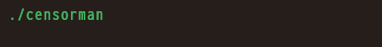
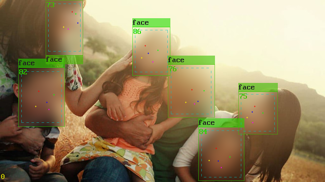
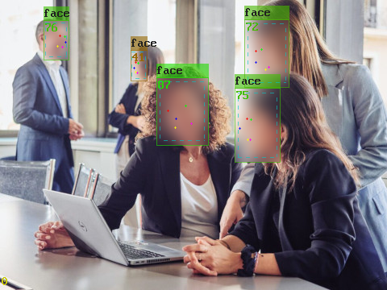
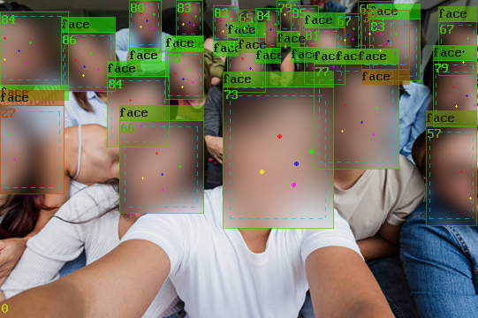
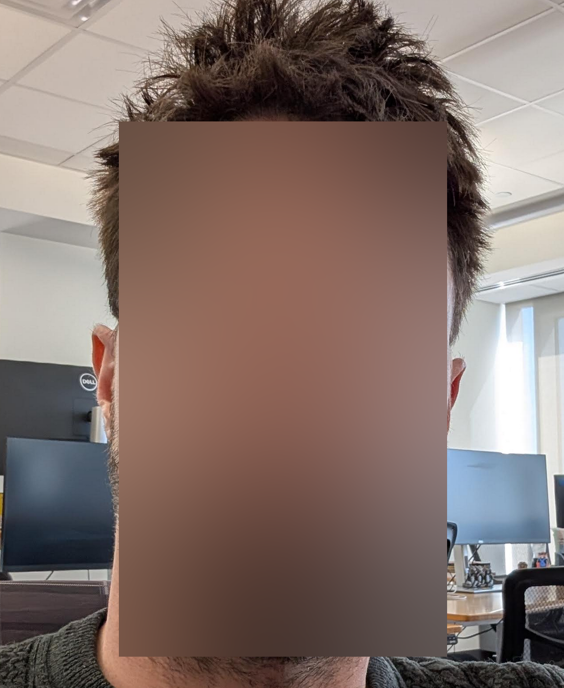
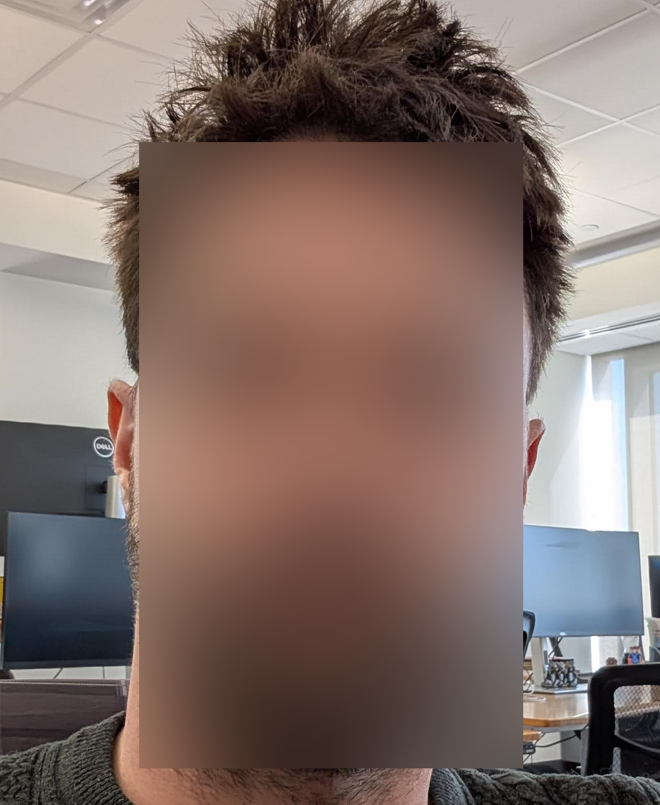
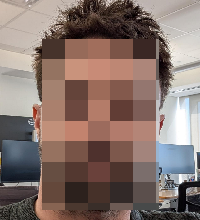
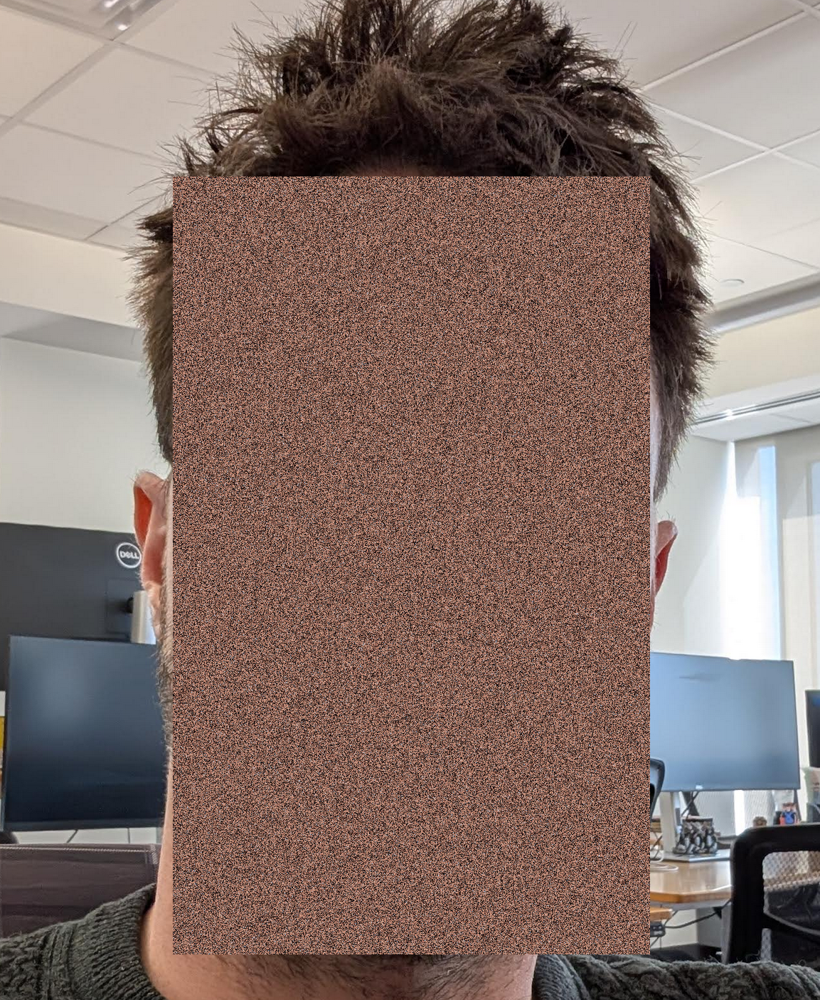
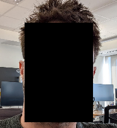
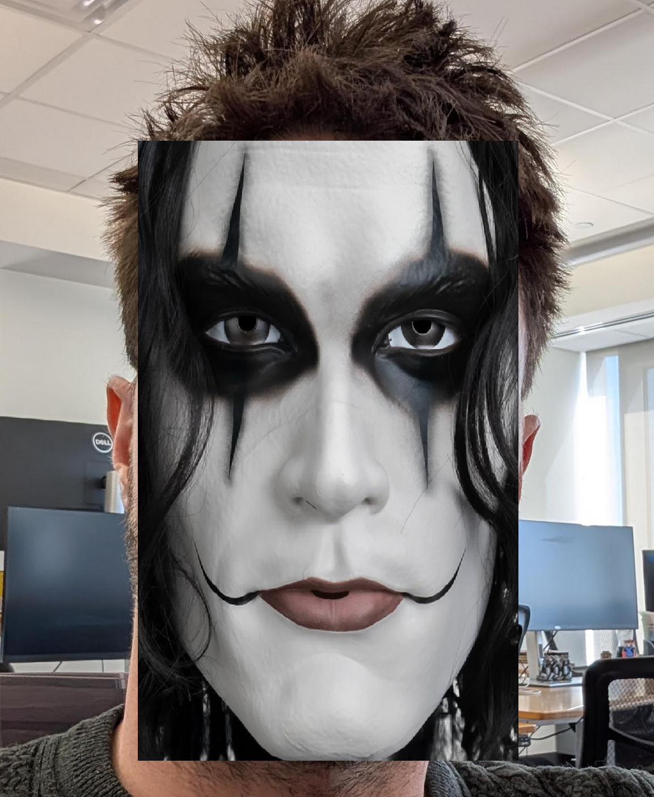

# Censorman

Automatically detect **faces**, **people**, **license plates**, or **nudity** in images and videos and apply filters to these regions



| Before                      |  After                         |
|:---------------------------:|:------------------------------:|
|       |  |
|        |   |
|        |   |

## Latest Binaries

Censorman V2.1

| Windows | MacOS | Linux |
|---------|--------|-------|
| [censorman.zip (x86\_64)](https://github.com/chrisomatic/censorman/releases/latest/download/censorman-v2_1-win-x86_64.zip) | [censorman.tar.gz (amd64)](https://github.com/chrisomatic/censorman/releases/latest/download/censorman-v2_1-darwin-amd64.tar.gz) | [censorman.tar.gz (x86\_64)](https://github.com/chrisomatic/censorman/releases/latest/download/censorman-v2_1-linux-x86_64.tar.gz)

## Filters

Filters can be applied to detected bounding boxes, and can be stacked to create different effects.

| Filter Type   | Parameter     | Value Range | Default Value | Example                |
|:-------------:|:-------------:|:-----------:|:-------------:|:----------------------:|
| Box Blur      | Blur Strength | 0.0 - 1.0   | 0.50          |  |
| Gaussian Blur | Blur Strength | 0.0 - 1.0   | 0.50          |  |
| Pixelate      | Block Scale   | 0.0 - 1.0   | 0.12          |  |
| Scramble      | -             | -           | -             |  |
| Blackout      | -             | -           | -             |  |
| Texture       | Texture Path  | string      | "" (empty)    |  |

## Supported Formats

- Image: JPG, PNG, BMP, PSD, TGA, HDR, PIC, GIF(unanimated), PNM
- Video: MP4, MOV, AVI, WMV, WEBM

> [!NOTE]
> Output video is encoded as MP4 (MPEG-4 YUV420p)
> Audio if distored is re-encoded as AAC, otherwise it is passthrough

## Details

- Command-Line Tool
- Statically built single binary
- Embedded CNNs (no external services)
- Runs entirely on CPU
- Threading enabled for video files
- Interpolation of Bounding Boxes for videos with configurable smoothing window
- Filters (like blur) can be chained together with custom parameters
- Many assets can be processed in a single command
- Configurable box padding
- Output bounding box data to file (BBX)

## Model Details

| Class             | Model                                 | Confidence Threshold (Default) | NMS IoU Threshold (Default) |
|-------------------|---------------------------------------|--------------------------------|-----------------------------|
| Face (default)    | scrfd_2.5g_bnkps                      | 0.42 (42%)                     | 0.45 (45%)                  |
| Face 10G          | scrfd_10g_bnkps                       | 0.42 (42%)                     | 0.45 (45%)                  |
| Person            | InsightFace SCRFD 2.5g Person         | 0.50 (50%)                     | 0.50 (50%)                  |
| License Plate     | YOLOv8 trained 2.5g                   | 0.50 (50%)                     | 0.45 (45%)                  |
| Nudity            | NudeNET                               | 0.25 (25%)                     | 0.45 (45%)                  |

WIDER face benchmarks:

| Model              | Easy  | Medium | Hard  |
|--------------------|-------|--------|-------|
| scrfd\_2.5g\_bnkps | 93.80 | 92.02  | 77.13 |
| scrfd\_10g\_bnkps  | 95.40 | 94.01  | 82.80 |

## Install pre-made binaries

If you want to just install censorman on your machine, you can run the install script to pull the correct file from the latest release and place it in an appropriate folder

```sh
# MacOS / Linux
./scripts/install.sh

# Windows
./scripts/install.bat
```

## Build it yourself

The build scripts will detect your operating system.

To build on Windows, run in MSYS2 MingW environment

```sh
# build dependencies (do once)
./scripts/build_deps.sh all

# build censorman
./build.sh prod

# run the dang program
bin/censorman
```

## Dependencies

All dependencies are built from source and statically linked to final binary (except GLIBC which requires >= 2.36)

| Name              | Function               | Link                                              |
|-------------------|------------------------|---------------------------------------------------|
| ffmpeg            | Video/Audio Processing | https://git.ffmpeg.org/ffmpeg.git                 |
| libx264           | H.264 Video Encoding   | https://code.videolan.org/videolan/x264.git       |
| libvpx            | VPX Video Encoding     | https://chromium.googlesource.com/webm/libvpx.git |
| libexif           | EXIF Metadata          | https://github.com/libexif/libexif.git            |
| ncnn              | CNN Inference Engine   | https://github.com/tencent/NCNN                   |
| stb\_image        | Image Reading/Writing  | https://github.com/nothings/stb                   |

# Example Commands

## 1. Simply blur faces in an image (Default)

```sh
./censorman img/office.jpg -f blur
```

## 2. Blur people and license plates in a folder of assets

```sh
./censorman assets/ -d person,license_plate
```

## 3. Blur faces in video with custom filter and include debug markup

```sh
./censorman assets/hello.mp4 -f blur:0.3,pixelate:0.05 --debug
```

## 4. Texture faces on a video file

```sh
./censorman assets/hello.mp4 -f texture --texture_path img/mask.png
```

## 5. Blur faces in an image with a confidence threshold of 35% and NMS Threshold 45%

```sh
./censorman img/image.jpg -d face:0.35:0.45 -f blur
```

## 6. Blur only the eyes and nose of faces in a video, and distort the audio

```sh
./censorman assets/hello.mp4 -d face -f blur --facial_features eyes,nose --distort_audio 200.0
```

## 7. Detect faces in a video and output bounding box data to file, don't save an output

```sh
./censorman assets/hello.mp4 -d face -f none --bbx_file out.bbx --no_encode
```

## Add a new model

The CNN models used by censorman are NCNN formatted (.bin / .param)

To integrate a new model into censorman, find one that has an NCNN version or ONNX version and convert it to NCNN with pnnx tool

> [!NOTE]
> It is recommended to use smaller models (2.5g or 500m if possible)

From there, you can use ncnn2mem tool to convert the model data into C arrays. Copy the binary data header into src/model\_data/

Modify the source code starting with detect.h and add a new value to DetectType enum. In detect.c copy a function like detect\_face for your own class

You can modify settings.c to add support for your model on the command-line

## Help

```
[CENSORMAN V2.2]
    _O_
  /|-X-|\
 /  \_/  \
    / \
  _/   \_

USAGE
    censorman <asset_path> [options | flags]

ASSET_PATH
    Accepts comma-separated list of image and video file paths, or a folder path (searches recursively).
    * Supported image formats: [ PNG, JPG, BMP, PSD, GIF, TGA, HDR, PIC, PNM ]
    * Supported video formats: [ MP4, MOV ]

OPTIONS
    --detect [-d] <detect-types>
        a comma-separated list of detect types [face,face_10g,person,license_plate,nudity]
        default: face
        Each detect type can specify up to two optional parameters with ':' between them
        The first parameter is confidence threshold
        The second parameter is NMS IOU threshold

    --filter [-f] <filters>
        a comma-separated list of filters [blur,gaussian_blur,pixelate,scramble,blackout,texture]
        default: blur
        Each filter can specify an optional parameter with ':' followed by an optional flag to enable an elliptical mask (e.g blur:0.20:1)
        This parameter indicates 'blur_strength' for blur and gaussian_blur, or
        'block_scale' with pixelate

    --output_folder [-o] <output_folder_path>
        Specify the output folder of processed assets (images/videos).
        If the folder doesn't exist, it will be created
        Default: output

    --distort_audio [-da] <distortion_hz>
        Apply a ring modulation to the audio stream of a video file.
        A typical range for distortion is 150 Hz to 300 Hz

    --thread_count [-j] <thread_count>
        Specify thread count. Used for video processing. Images are processed single-threaded.
        Default: Number of logical cores

    --buffer_size [-bs] <buffer_size_bytes>
        Set the maximum buffer size for video frames. Video frames are loaded in chunks, so
        larger chunks allow more frames of a video to be decoded at a time.
        Default: 536870912 (512 MB)

    --box_padding [-bp] <box_padding_percent>
        Specify the box padding percentage. Padding is added at the end of the detection.
        Default: 0.15 (15 %)

    --smoothing_window [-sw] <smoothing_window_seconds>
        Used for video interpolation of detection boxes. Interpolation is an exponentional smooth.
        There is also an implicit first stage to find discontinuities and fast motion
        and schedule those frames for detection
        Default: 0.200 (200 ms)

    --texture_path [-tp] <texture_path>
        Supply a path to an image file that is stretched over bounding boxes on the output.
        Used with the --filter texture option

    --bbx_file [-bbx] <bbx_file_path>
        Bounding-box output file. If specified, the detect box data will be written to a file

    --facial_features [-ff] <facial_features>
        Break the facial box into sub-boxes. Comma-delimited list of ['eyes','nose','mouth','cheeks','forehead']

    --thumbnail [-tn] [<thumbnail_width>x<thumbnail_height>]
        Produce a *_thumbnail.png for each asset. Default thumbnail dimensions are 250x250
        Maintains aspect ratio, so the longest dimension will be set and the other
        adjusted to that

FLAGS
    --bbx_file_format [-bff]  Print information about the file format for BBX files
    --no_encode [-ne]         Disable the writing of the processed output file(s)
    --debug [-db]             Enable debug info markout on output. Draws boxes on output with labels
    --no_labels [-nl]         Use with --debug flag to exclude the labels on the debug markup
    --verbose [-vb]           Turn on verbose console prints
    --elliptical [-el]        Mask all filters to a rounded elliptical shape
    --stopwatch [-sw]         Turn on stopwatch prints for timing information
    --quiet [-q]              Disable all console prints
    --help [-h]               Display this help output

EXAMPLES
    1.  Just run default settings on test1.png (detect faces and apply box blur)
          censorman assets/images/test1.png

    2.  Detect persons on all supported files in assets/images and pixelate boxes with a block scale of 0.12
          censorman assets/images -d person -f pixelate:0.12

    3.  Apply box blur to faces and license plates in vid1.mp4 with debug markup
          censorman assets/videos/vid1.mp4 -d face,license_plate -f blur --debug
```

## Bounding Box (BBX) File Format

The Bounding Box file can be specified as an output on command line. All integer types are stored in little-endian byte order.

```
BBX FILE FORMAT (V2)

A binary format that contains bounding box data for a list
of video and image assets.

|---------------------------------------------------------------|
|      name      |    format   | byte length |   description    |
|----------------|-------------|-------------|------------------|<......
| Magic Word     | char array  | 3           | 'BBX'            |      :
| Version        | u8          | 1           |  2               |   preamble
| Asset Count    | u32         | 4           | Number of Assets |      :
|----------------|-------------|-------------|------------------|<.....:
| Index          | u32         | 4           | Asset Index      |      :
| Type           | u8          | 1           | 1:Image 2:Video  |      :
| Path Len       | u64         | 8           | File Path Length |      :
| Path           | char array  | <path len>  | Of Asset File    |   asset N
| Width          | u16         | 2           | In Pixels        |      :
| Height         | u16         | 2           | In Pixels        |      :
| FPS            | float32     | 4           | Frames Per Sec   |      :
| Frame Count    | u32         | 4           | Number of Frames |      :
|----------------|-------------|-------------|------------------|<.....:
| Frame Number   | u32         | 4           | Frame Index      |      :
| Box Count      | u32         | 4           | Number of Boxes  |   frame M
| Interpolated   | u8          | 1           | 0:False 1:True   |      :
|----------------|-------------|-------------|------------------|<.....:
| Box Type       | u8          | 1           | <detect type>    |      :
| Position X     | u16         | 2           | In Image         |      :
| Position Y     | u16         | 2           | In Image         |      :
| Width          | u16         | 2           | In Pixels        |      :
| Height         | u16         | 2           | In Pixels        |      :
| Confidence     | u8          | 1           | [0-100]          |      :
| Landmark 1 X   | u16         | 2           | Left Eye X       |      :
| Landmark 1 Y   | u16         | 2           | Left Eye Y       |    box B
| Landmark 2 X   | u16         | 2           | Right Eye X      |      :
| Landmark 2 Y   | u16         | 2           | Right Eye Y      |      :
| Landmark 3 X   | u16         | 2           | Nose X           |      :
| Landmark 3 Y   | u16         | 2           | Nose Y           |      :
| Landmark 4 X   | u16         | 2           | Mouth Left X     |      :
| Landmark 4 Y   | u16         | 2           | Mouth Left Y     |      :
| Landmark 5 X   | u16         | 2           | Mouth Right X    |      :
| Landmark 5 Y   | u16         | 2           | Mouth Right Y    |      :
|----------------|-------------|-------------|------------------|<......

N := Range [0...Asset Count]
M := Range [0...Frame Count]
B := Range [0.....Box Count]

MORE TABLES

|---------------|-------|
| detect type   | value |
|---------------|-------|
| face          | 1     |
| person        | 2     |
| license_plate | 3     |
| nudity        | 4     |
|...............|.......|
| eye           | 16    |
| nose          | 17    |
| mouth         | 18    |
| cheeks        | 19    |
| forehead      | 20    |
|---------------|-------|
```

