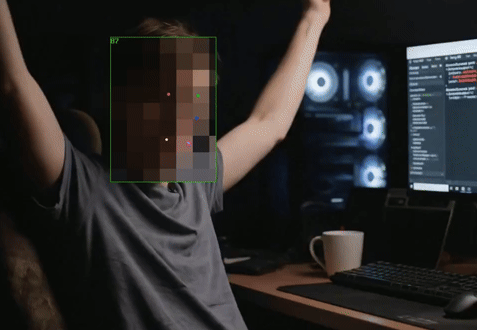

# Censorman

Command-line tool to censor faces in __images__ and __videos__!

```
      "All in a day's work!"
                - Censor Man
   _O_
 /|-x-|\
/  \_/  \
   / \
 _/   \_

```

## Example Commands

```sh
# blur faces in an image
censorman assets/crowd.jpg -t blur

# scramble and pixelate faces in an image
censorman assets/crowd.jpg -t scramble,pixelate

#  blur faces in video with debug boxes
censorman assets/nosound_1face_60s.mp4 -t pixelate --debug
```

Before Blur                |  After Blur
:-------------------------:|:-------------------------:
         | 

Video example




## Get Latest Builds

- Linux:   [censorman](https://github.com/chrisomatic/censorman/releases/latest/download/censorman)
- Windows: [censorman.exe](https://github.com/chrisomatic/censorman/releases/latest/download/censorman.exe)
- MacOS: (soon)

## How to build and run

Linux

```sh
# do once
./ffmpeg_build.sh

# build censorman
./build.sh

# run the dang program
bin/censorman
```

MacOS

```sh
# do once
./ffmpeg_build.sh macos

# build censorman
./build.sh macos

# run the dang program
bin/censorman
```

Windows

```sh
# do once
ffmpeg_build.cmd

# build censorman
build.cmd

# run the dang program
bin\censorman
```

## Dependencies

- [libfacedetection](https://github.com/ShiqiYu/libfacedetection)
- [ffmpeg](https://git.ffmpeg.org/ffmpeg.git)
- [stb\_image](https://github.com/nothings/stb/blob/master/stb_image.h)
- [stb\_image\_write](https://github.com/nothings/stb/blob/master/stb_image_write.h)

## Credits

### Face Detection

This project uses the libfacedetection model created by Shiqi Yu on GitHub (https://github.com/ShiqiYu/libfacedetection)

### Image Reading / Writing

Thanks to the awesome Sean Barrett for his open source single-header libraries (https://github.com/nothings/stb/)


### Video

FFMPEG is being pulled, built, and statically linked for this project

## Usage

```
[USAGE]
    censorman <in_file> -o <out_file> -d {class_list} -t {transform_list} [-c confidence_threshold][-j thread_count] [--debug] [--image <texture_image_path>] [--bbx_output <bbx_output_filepath>] [--block_scale <block_scale>] [--blur_strength <blur_strength>] [--max_buffer_size <buffer_size>] [--scaled_size <scaled_size>] [--box_padding_pct <padding_pct>] [--no_scale] [--no_encoding] [--quiet] [--verbose]

[DESCRIPTION]
    Takes an image or video file, detects regions of human faces (for now), applies transformations on those regions and writes back an output file

[ARGUMENTS]
    in_file:              Path to input image (or video) file (or folder) (.jpg, .png, .bmp, .mp4, .mov)
    out_file:             Path to output image (or video) file (.jpg, .png, .bmp, .mp4)
    class_list:           {face}
    transform_list:       {pixelate, blur, blackout, scramble, texture}
    confidence_threshold: Discard any boxes lower than this (0 - 100)
    thread_count:         How many threads to use to detect (default to number of cores)
    debug:                Print debug info and draw boxes on output image
    texture_image_path:   Used with 'texture' transform
    block_scale:          Value between 0.0 and 1.0. Used to scale blocks in pixelate transform
    blur_strength:        Value between 0.0 and 1.0. Blur is a box blur. (Default: 0.50)
    frame_smoothing_window:  Smoothing window for lerping between frames of video (Default: 0.150 or 150m
    buffer_size:          Number of bytes for video frames during conversion (Default: 1 GB)
    scaled_size:          The longest dimension in pixels to scale down to (Default: 640 for images, 320 for videos)
    padding_pct:          Added percentage of padding to detected boxes (Default: 0.15)
    no_encoding:          Prevents writing output image or video file
    bbx_output_filepath:  Bounding boxes output file. Specify if you want this file output.
    no_scale:             Disables downscaling of images and videos before detections
    quiet:                Suppress standard log output
    verbose:              Enable verbose log output

```

## Bounding Box File Format

The Bounding Box file can be specified as an output on command line. All integer types are stored in little-endian byte order.

**File Header (16 Bytes)**

| Index | Section        | Size (B) | Data Type | Description                    |
|-------|----------------|----------|-----------|--------------------------------|
|     0 | Header         |        3 |    Char[3]| Magic. 'B','B','X'             |
|     3 | Header         |        1 |        U8 | Version (Should be 1)          |
|     4 | Header         |        2 |       U16 | Frame Width                    |
|     6 | Header         |        2 |       U16 | Frame Height                   |
|     8 | Header         |        4 |       F32 | FPS                            |
|    12 | Header         |        4 |       U32 | Number of Frames               |

**Frame**

Where f = 0 to Number of Frames

| Index | Section        | Size (B) | Data Type | Description                    |
|-------|----------------|----------|-----------|--------------------------------|
|f + 16 | Frame 0 Header |        4 |       U32 | Frame Index                    |
|f + 20 | Frame 0 Header |        2 |       U16 | Number of Bounding Boxes       |
|f + 22 | Box 0 Data     |        2 |       U16 | X Position (Top-left)          |
|f + 24 | Box 0 Data     |        2 |       U16 | Y Position (Top-left)          |
|f + 26 | Box 0 Data     |        2 |       U16 | Width                          |
|f + 28 | Box 0 Data     |        2 |       U16 | Height                         |
|f + 30 | Box 0 Data     |        2 |       U16 | Confidence                     |
|f + 32 | Box 0 Data     |        2 |       U16 | Left eye X                     |
|f + 34 | Box 0 Data     |        2 |       U16 | Left eye Y                     |
|f + 36 | Box 0 Data     |        2 |       U16 | Right eye X                    |
|f + 38 | Box 0 Data     |        2 |       U16 | Right eye Y                    |
|f + 40 | Box 0 Data     |        2 |       U16 | Nose X                         |
|f + 42 | Box 0 Data     |        2 |       U16 | Nose Y                         |
|f + 44 | Box 0 Data     |        2 |       U16 | Right mouth X                  |
|f + 46 | Box 0 Data     |        2 |       U16 | Right mouth Y                  |
|f + 48 | Box 0 Data     |        2 |       U16 | Left mouth X                   |
|f + 50 | Box 0 Data     |        2 |       U16 | Left mouth Y                   |
|f + 52 | Box 0 Data     |        1 |        U8 | Interpolated (0=No, 1=Yes)     |
| ...   | ...            |      ... |       ... | ...                            |
|f + N  | Box N Data     |          |           |                                |

